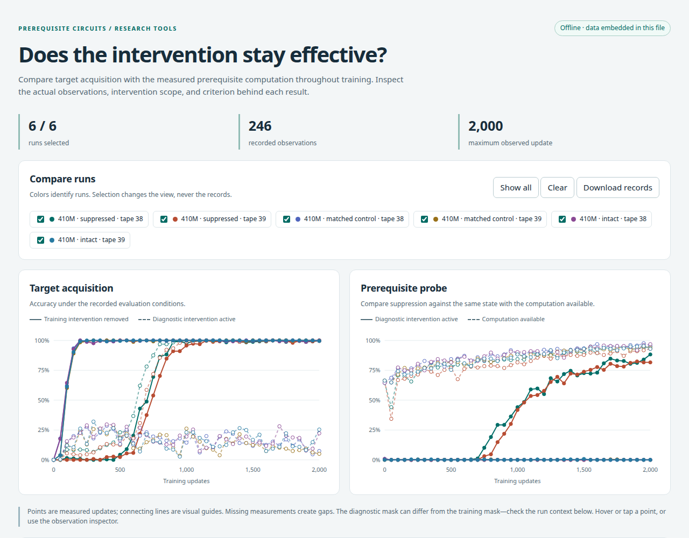

# Package guide

Install from [PyPI](https://pypi.org/project/prerequisite-circuits/):

```bash
python -m pip install prerequisite-circuits
```

The base package reads records and generates interactive HTML reports without
third-party dependencies. Add `[train]` for PyTorch, `[plot]` for figures, or
`[pythia]` for the Hugging Face GPT-NeoX integration. The package is version 0.1:
the scientific scope is explicit and the API may change before 1.0.

## Attach to an existing trainer

Keep your own model, optimizer, scheduler, and distributed setup. Create a
`Trajectory`, evaluate at fixed updates, and append an `Observation`. Save both
the target score with training interventions removed and the prerequisite score
with the intervention active. Also record the same-state prerequisite score with
the intervention removed. The criterion checks both an absolute suppression
threshold and a relative drop.

```python
from prerequisite_circuits import Criterion, Observation, Trajectory
from prerequisite_circuits.interventions import NeoXHeads
from prerequisite_circuits.state import evaluation

monitor = Trajectory("suppressed", Criterion(.2, .3, .5))
intervention = NeoXHeads(model, [(2, 3), (3, 5)])  # user-supplied candidates

# Inside your existing update loop; scope identifies target-training rows.
with intervention.apply(scope=target_rows):
    loss = training_loss(model, batch)
    loss.backward()
optimizer.step()

# At predetermined observation steps; readout functions are supplied by your task.
with evaluation(model):
    target = target_accuracy(model)
    available = prerequisite_accuracy(model)
    with intervention.apply():
        suppressed = prerequisite_accuracy(model)
        target_masked = target_accuracy(model)
monitor.append(Observation(step, target, available, suppressed, target_masked))
```

This is an integration sketch, not a self-contained training program. A complete
CPU example is `prereq demo`. Probe evaluations must not edit parameters. The
evaluation context catches ordinary in-place parameter edits, restores buffers
and RNGs, and restores every module's prior training/evaluation mode. It cannot
make arbitrary user callbacks safe: do not mutate `.data`, replace parameters,
change optimizer state, or select interventions inside an observation callback.

## Interventions

`Channels(module, indices, location="input" | "output")` replaces selected
last-axis channels. Scope can be a Boolean batch-row mask or a full token-position
mask. `replacement=None` means zero. A supplied tensor must match the full
activation shape; only selected channels and positions are replaced. Donors are
detached unless explicitly requested otherwise.

`NeoXHeads(model, heads)` applies the same operation before GPT-NeoX attention
output projection. A layer-to-activation dictionary supplies replacements for all
selected layers. Whole head contributions can carry several computations; a
head mask is not automatically selective removal of induction.

`capture(module, location=...)` collects detached copies during a context. Check
donor inputs, parameter dependencies, batch alignment, and restoration numerically
when interpreting supplied activations as a fixed computation. The package does
not infer those dependencies.

## Matched small experiments

`run_branches` accepts an existing model, `ReplayTape`, branch intervention
contexts, optimizer factory, training loss, and observer. It copies the model,
starts a fresh optimizer for each arm, resets training RNGs identically, and
checks every actual batch digest against the first arm before updating. Evaluation
does not advance the training RNG. The caller's model is not trained.

This reference runner supports ordinary single-device float32 training. It does
not resume optimizer moments, run a scheduler, distribute a model, or manage mixed
precision. Those workflows should use the monitor in an existing trainer and
declare their state/resume policies. Paper FSDP recipes retain their own backend.

`ReplayTape.from_batches` copies a short in-memory tape. For larger experiments,
use a deterministic iterator factory with local RNGs. The declared update budget
is the consumed prefix; too few batches or different bytes are errors.

## Reports

```bash
prereq report results/reference/410m_*.json --html outputs/report.html --open
```

The interactive report is one HTML file: open it locally, select runs, inspect
points or exact observations, and download the embedded records. It works offline,
including on mobile, with no server, account, or plotting dependency. Sharing the
HTML shares all its data and metadata, including runs hidden in the current view.
The exported JSON collection can be passed back to `prereq report`.



`Trajectory.save` writes schema-versioned JSON. `prereq report` recomputes its
summary, ignoring any stored summary, and can export HTML or PDF/PNG/SVG plots.
Acquisition is the first **observed** crossing of the declared target-accuracy
threshold, not an interpolated update or a guarantee of lasting acquisition.
Missing probes remain missing. A later failed suppression check is reported even
if suppression subsequently recovers.

The core probe criterion currently uses accuracy in [0, 1]. Store arbitrary losses,
uptake in nats, confidence intervals, and task-specific checks in companion records
or metadata; do not force them into probability fields. The paper's plotting
recipes retain its original uptake measurements.

## Distribution

The wheel and source distribution are built with `python -m build`. They contain
the reusable package; the paper records and historical experiment sources are
repository/release assets and are not installed into Python environments.

Releases are published through GitHub Actions using PyPI trusted publishing.
See [Development and releases](development.md) for the release process. Each
published version is immutable; later changes receive a new version.
